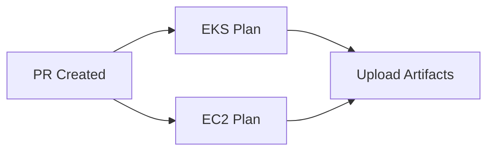
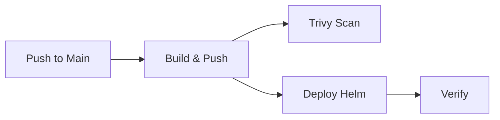

# Wiz Tech Exercise

Implementation of an intentionally exposed AWS cloud environment to demonstrate Cloud Native Security and DevSecOps best practices.

## Architecture Overview

### Security (Intentional Weaknesses - "Weak by Design")

This project intentionally includes security misconfigurations for educational purposes:

- **EC2 MongoDB VM**:
  - SSH open to `0.0.0.0/0`
  - IAM role with `AdministratorAccess`
  - Outdated Ubuntu 20.04 LTS
  - Outdated MongoDB 4.4
  - S3 backups publicly readable and listable
- **Kubernetes**:
  - Application ServiceAccount has `cluster-admin` role
  - Ingress exposed via public ALB

### Components

- **EKS Cluster**: Kubernetes 1.31
- **MongoDB VM**: 4.4 on EC2 (t3.micro, Ubuntu 20.04)
- **Web Application**: Go app in private EKS subnet
- **Load Balancer**: AWS Application Load Balancer via Ingress Controller
- **Container Registry**: Amazon ECR
- **Backups**: Daily MongoDB dumps to S3 (public-read)

### Network

- **VPC**: 10.123.0.0/16
- **Public Subnets**: 3 AZs (ALB, NAT Gateways, MongoDB)
- **Private Subnets**: 3 AZs (EKS worker nodes)
- **Intra Subnets**: 3 AZs (EKS control plane)

---

## Prerequisites

### Local Development

- AWS CLI configured with SSO profile `wiz`
- Terraform >= 1.5
- Ansible >= 2.15
- Docker
- kubectl
- Helm 3
- Trivy (for security scanning)
- SSH key pair (`~/.ssh/id_ed25519`)

### CI/CD (GitHub Actions)

- GitHub repository with Actions enabled
- AWS account with permissions to create IAM OIDC provider
- GitHub Secrets configured (see CI/CD Setup section)

---

## Quick Start (Local Development)

### Full Deployment (One Command)

```bash
AWS_PROFILE=wiz make deploy-all
```

**Duration**: ~20-25 minutes

**Steps executed**:
1. Deploy EKS cluster (VPC, subnets, node groups, addons)
2. Deploy EC2 MongoDB instance (outdated Ubuntu 20.04, weak security)
3. Configure Ansible inventory dynamically
4. Install MongoDB 4.4 via Ansible (with authentication + daily S3 backups)
5. Build and push Docker image to ECR
6. Deploy AWS Load Balancer Controller via Helm
7. Deploy application via Helm (with Ingress + ALB)

### Manual Step-by-Step Deployment

#### 1. Infrastructure Setup

```bash
AWS_PROFILE=wiz make eks-apply
AWS_PROFILE=wiz make ec2-apply
```

**Wait**: ~12-15 minutes for EKS cluster readiness.

#### 2. MongoDB Configuration

```bash
# Create vault password file (optional, avoids manual entry)
AWS_PROFILE=wiz make ansible-create-vault-pass

# Update inventory with Terraform outputs
AWS_PROFILE=wiz make ansible-setup

# Run Ansible playbook
AWS_PROFILE=wiz make ansible-run
```

**Vault Password**: Provide Ansible Vault password when prompted (or use vault password file).

#### 3. Application Deployment

```bash
AWS_PROFILE=wiz make app-build
AWS_PROFILE=wiz make app-push
AWS_PROFILE=wiz make helm-setup
AWS_PROFILE=wiz make helm-deploy
```

#### 4. Verify Deployment

```bash
AWS_PROFILE=wiz make helm-status
```

**Access the application**: Use the ALB hostname from `helm-status` output.

---

## CI/CD Setup (GitHub Actions)

### Milestone 5: Automated CI/CD Pipelines

The project includes two GitHub Actions workflows:

1. **IaC Pipeline** (`.github/workflows/iac-cicd.yml`):
   - **On PR**: Terraform plan for EKS and EC2
   - **On Main**: Terraform apply + Ansible configuration

2. **App Pipeline** (`.github/workflows/app-cicd.yml`):
   - **On Main**: Build Docker image → Push to ECR → Deploy via Helm

### Architecture: OIDC + AWS Secrets Manager

**Security Features**:
- ✅ **No long-term AWS credentials** (GitHub OIDC → IAM Role)
- ✅ **SSH key generated and stored in AWS Secrets Manager**
- ✅ **Ansible Vault password in AWS Secrets Manager**
- ✅ **Automatic secret retrieval in CI/CD**

### Step-by-Step CI/CD Configuration

#### Step 1: Update GitHub Organization/Repo in Terraform

Edit `iac/github-oidc/main.tf`:

```hcl
locals {
  github_org  = "your-github-username"
  github_repo = "wiz-tech-exercise"
}
```

#### Step 2: Create Ansible Vault Password File (Local)

```bash
# Generate a strong password
openssl rand -base64 32 > ~/.ansible_vault_pass
chmod 600 ~/.ansible_vault_pass

# Use it to re-encrypt the vault
cd iac/envs/dev/ansible
ansible-vault rekey group_vars/mongo/vault.yml --vault-password-file ~/.ansible_vault_pass
```

#### Step 3: Deploy CI/CD Infrastructure

```bash
cd iac/github-oidc

# Create terraform.tfvars
cp terraform.tfvars.example terraform.tfvars

# Edit terraform.tfvars with your Ansible Vault password
nano terraform.tfvars
```

```hcl
aws_region             = "us-east-1"
ansible_vault_password = "paste-your-vault-password-here"
```

```bash
# Deploy OIDC provider, IAM role, and secrets
AWS_PROFILE=wiz terraform init
AWS_PROFILE=wiz terraform apply
```

**Outputs**:
- `github_actions_role_arn`: IAM role ARN for GitHub Actions
- `ssh_public_key`: SSH public key (use in EC2 Terraform)
- `ssh_private_key_secret_arn`: Secret ARN for SSH private key
- `ansible_vault_password_secret_arn`: Secret ARN for Ansible Vault password

#### Step 4: Retrieve SSH Public Key

```bash
cd iac/github-oidc
AWS_PROFILE=wiz terraform output -raw ssh_public_key
```

Copy this public key and update `iac/envs/dev/ec2/terraform.tfvars`:

```hcl
mongo_ssh_public_key = "ssh-ed25519 AAAA... (output from above)"
```

#### Step 5: Configure GitHub Secrets

Go to your GitHub repository → **Settings** → **Secrets and variables** → **Actions** → **New repository secret**

Add:

| Secret Name | Value | Description |
|-------------|-------|-------------|
| `AWS_GITHUB_ACTIONS_ROLE_ARN` | Output from `terraform output github_actions_role_arn` | IAM Role ARN for OIDC authentication |

#### Step 6: Configure GitHub Environment

1. Go to **Settings** → **Environments** → **New environment**
2. Create environment: `production`
3. (Optional) Add protection rules:
   - Required reviewers
   - Wait timer
   - Deployment branches: `main` only

#### Step 7: Test CI/CD

##### Test IaC Pipeline (PR)

```bash
git checkout -b test-cicd
git add .
git commit -m "test: CI/CD setup"
git push origin test-cicd
```

Create a PR on GitHub. The workflow will:
- Run Terraform plan for EKS and EC2
- Upload plan artifacts

##### Test Full Deployment (Main)

Merge the PR to `main`. The workflows will:
1. **IaC Pipeline**:
   - Apply EKS infrastructure
   - Apply EC2 infrastructure
   - Run Ansible configuration (MongoDB install + backup setup)
2. **App Pipeline** (triggered by app changes):
   - Build Docker image
   - Scan with Trivy
   - Push to ECR
   - Deploy to EKS via Helm

---

## Local SSH Access to MongoDB VM

### Using Your Personal SSH Key (Local Development)

If you deployed locally with your own SSH key:

```bash
# Get MongoDB public IP
cd iac/envs/dev/ec2
AWS_PROFILE=wiz terraform output mongo_public_ip

# SSH into VM
ssh -i ~/.ssh/id_ed25519 ubuntu@<MONGO_PUBLIC_IP>
```

### Using CI/CD Generated SSH Key

If infrastructure was deployed via CI/CD:

```bash
# Download private key from AWS Secrets Manager
AWS_PROFILE=wiz aws secretsmanager get-secret-value \
  --secret-id /wiz-tech-exercise/ssh-private-key \
  --query SecretString \
  --output text > ~/.ssh/wiz-mongo-key

chmod 600 ~/.ssh/wiz-mongo-key

# Get MongoDB public IP
cd iac/envs/dev/ec2
AWS_PROFILE=wiz terraform output mongo_public_ip

# SSH into VM
ssh -i ~/.ssh/wiz-mongo-key ubuntu@<MONGO_PUBLIC_IP>
```

---

## Configuration Files

### Terraform Variables

#### EKS (No variables required, uses defaults)

#### EC2

Create `iac/envs/dev/ec2/terraform.tfvars`:

```hcl
mongo_ssh_public_key = "ssh-ed25519 AAAA... your-user@host"
```

### Ansible Vault

Secrets are stored in `iac/envs/dev/ansible/group_vars/mongo/vault.yml` (encrypted).

#### Create New Vault

```bash
ansible-vault create iac/envs/dev/ansible/group_vars/mongo/vault.yml
```

Content:

```yaml
---
mongo_admin_user: admin
mongo_admin_password: SuperSecretPassword123!
```

#### Edit Existing Vault

```bash
# With vault password file
ansible-vault edit iac/envs/dev/ansible/group_vars/mongo/vault.yml --vault-password-file ~/.ansible_vault_pass

# Or with prompt
ansible-vault edit iac/envs/dev/ansible/group_vars/mongo/vault.yml
```

---

## Makefile Targets

### Infrastructure

- `make eks-apply`: Deploy EKS cluster
- `make ec2-apply`: Deploy EC2 MongoDB instance
- `make eks-destroy`: Destroy EKS cluster
- `make ec2-destroy`: Destroy EC2 instance
- `make eks-outputs`: Show EKS outputs (VPC, subnets, etc.)
- `make ec2-outputs`: Show EC2 outputs (IPs, bucket, ECR URL)

### Application

- `make app-build`: Build Docker image locally
- `make app-push`: Push image to ECR
- `make app-scan`: Run Trivy security scan

### Ansible

- `make ansible-create-vault-pass`: Create vault password file interactively
- `make ansible-setup`: Update inventory with Terraform outputs
- `make ansible-run`: Execute MongoDB installation playbook

### Kubernetes

- `make helm-setup`: Add Helm repos and configure kubectl
- `make helm-deploy`: Deploy ALB Controller + Application
- `make helm-status`: Show pods, services, ingress, and ALB URL

### CI/CD

- `make setup-cicd`: Deploy GitHub OIDC provider and IAM role

### Utilities

- `make deploy-all`: Full automated deployment (local)
- `make clean-all`: Destroy all infrastructure

---

## CI/CD Workflows Breakdown

### Workflow 1: IaC CI/CD (`.github/workflows/iac-cicd.yml`)

#### On Pull Request



**Jobs**:
1. `eks-plan`: Terraform plan for EKS
2. `ec2-plan`: Terraform plan for EC2 (depends on EKS state)

#### On Push to Main


**Jobs**:
1. `eks-apply`: Deploy EKS cluster
2. `ec2-apply`: Deploy EC2 MongoDB VM
3. `ansible-configure`: Install MongoDB + configure backups

### Workflow 2: App CI/CD (`.github/workflows/app-cicd.yml`)

#### On Push to Main (App Changes)



**Jobs**:
1. `build-and-push`: Build Docker image → Push to ECR → Trivy scan
2. `deploy-helm`: Deploy ALB Controller + Application

---

## Troubleshooting

### EKS Cluster Access

```bash
AWS_PROFILE=wiz aws eks update-kubeconfig --region us-east-1 --name wiz_cluster_eks
```

### Ansible Connection Issues

Verify EC2 instance is running and SSH key is correct:

```bash
AWS_PROFILE=wiz terraform -chdir=iac/envs/dev/ec2 output mongo_public_ip
ssh -i ~/.ssh/id_ed25519 ubuntu@<IP>
```

### ALB Not Provisioning

Check ALB Controller logs:

```bash
kubectl logs -n kube-system deployment/aws-load-balancer-controller
```

Verify IAM role has correct permissions and IRSA is configured.

### MongoDB Connection Test

Test from EKS pod:

```bash
kubectl run -it --rm mongo-test --image=mongo:4.4 --restart=Never -- \
  mongosh "mongodb://admin:SuperSecretPassword123!@<MONGO_PRIVATE_IP>:27017"
```

### CI/CD GitHub Actions Failing

#### OIDC Authentication Errors

Verify:
1. IAM OIDC provider is created
2. GitHub Actions role trust policy matches your repo
3. Secret `AWS_GITHUB_ACTIONS_ROLE_ARN` is correct

```bash
cd iac/github-oidc
AWS_PROFILE=wiz terraform output github_actions_role_arn
```

#### SSH Key Not Found

Ensure secrets are created in Secrets Manager:

```bash
AWS_PROFILE=wiz aws secretsmanager list-secrets --query "SecretList[?contains(Name, 'wiz-tech-exercise')].Name"
```

#### Ansible Vault Password Incorrect

Re-encrypt vault with correct password:

```bash
cd iac/envs/dev/ansible
ansible-vault rekey group_vars/mongo/vault.yml
```

Update Secrets Manager:

```bash
AWS_PROFILE=wiz aws secretsmanager put-secret-value \
  --secret-id /wiz-tech-exercise/ansible-vault-password \
  --secret-string "your-new-vault-password"
```

---

## Project Structure

```
.
├── .github/
│   └── workflows/
│       ├── iac-cicd.yml         # IaC pipeline (plan on PR, apply on main)
│       ├── app-cicd.yml         # App pipeline (build, push, deploy on main)
│       └── pr-app.yml           # App PR checks (build + Trivy scan)
├── app/                         # Go web application
├── iac/
│   ├── github-oidc/             # GitHub OIDC + IAM role + secrets
│   ├── envs/dev/
│   │   ├── eks/                 # EKS Terraform module
│   │   ├── ec2/                 # EC2 + ECR + S3 Terraform module
│   │   └── ansible/             # MongoDB configuration
│   └── kubernetes/
│       └── app/                 # Helm chart for application
├── Makefile                     # Automation commands
└── README.md                    # This file
```

---

## Security Best Practices (CI/CD)

### ✅ Implemented

1. **OIDC Authentication**: No long-term AWS credentials in GitHub
2. **Secrets Manager**: SSH keys and Ansible Vault password stored securely
3. **Least Privilege**: IAM role has scoped permissions (can be further restricted)
4. **Environment Protection**: `production` environment with optional approvals
5. **Trivy Scanning**: Container image vulnerabilities reported in SARIF format
6. **Secret Rotation**: Secrets can be rotated via Terraform re-apply

### 🔄 Recommendations for Production

1. **Terraform State**: Use remote backend (S3 + DynamoDB for locking)
2. **IAM Permissions**: Further scope down GitHub Actions role permissions
3. **Vault Password Rotation**: Automate rotation with AWS Secrets Manager rotation lambda
4. **SSH Key Rotation**: Implement key rotation strategy
5. **Branch Protection**: Require PR reviews before merging to `main`
6. **SAST/DAST**: Add static/dynamic application security testing
7. **Policy as Code**: Add OPA/Sentinel for Terraform policy enforcement

---

## License

This project is for educational purposes only. Do not use in production.

---

## Milestone Checklist

- [x] **Milestone 1**: EKS Cluster with VPC, subnets, node groups
- [x] **Milestone 2**: MongoDB VM (weak by design) + Ansible configuration
- [x] **Milestone 3**: Daily MongoDB backups to public S3
- [x] **Milestone 4**: Application containerization + Helm deployment + ALB Ingress
- [x] **Milestone 5**: CI/CD pipelines (IaC + App) with OIDC + Secrets Manager
